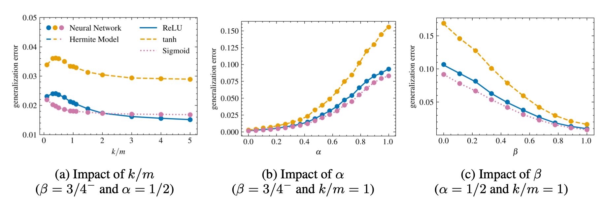
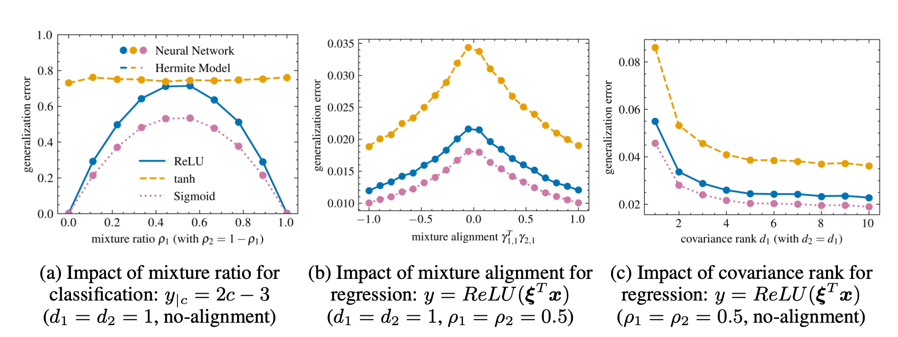
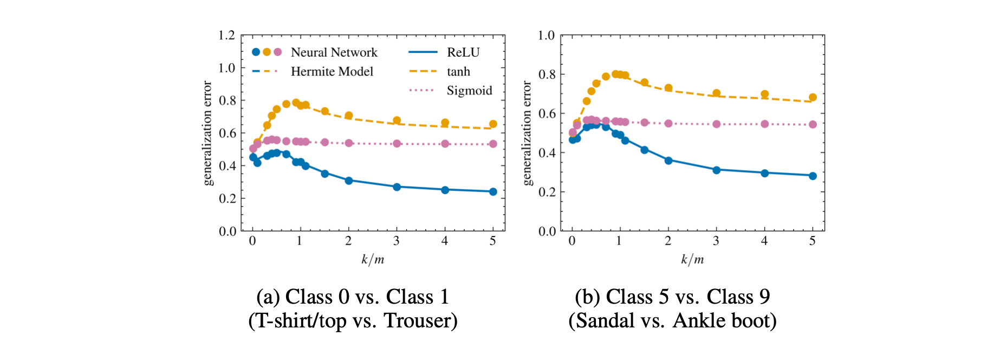

# Asymptotic Analysis of Two-Layer Neural Networks after One Gradient Step under Gaussian Mixtures Data with Structure
Code for the ICLR 2025 paper called "Asymptotic Analysis of Two-Layer Neural Networks after One Gradient Step under Gaussian Mixtures Data with Structure"

### [Paper Link](https://openreview.net/forum?id=tNn6Hskmti)
### - Samet Demir, Zafer Dogan

## Running the Code
- The code is written with Python 3 inside Jupyter Notebook (.ipynb) files. Each file corresponds to experiments/simulations for one of the figures (names of the files are self-explanatory). So, each figure can be reproduced by running the code inside the corresponding Jupyter Notebook (.ipynb).

- Required packages: numpy, jax, tqdm, scipy, scikit-learn, matplotlib, SciencePlots, torch, torchvision, imageio.


## Abstract
In this work, we study the training and generalization performance of two-layer neural networks (NNs) after one gradient descent step under structured data modeled by Gaussian mixtures. While previous research has extensively analyzed this model under isotropic data assumption, such simplifications overlook the complexities inherent in real-world datasets. Our work addresses this limitation by analyzing two-layer NNs under Gaussian mixture data assumption in the asymptotically proportional limit, where the input dimension, number of hidden neurons, and sample size grow with finite ratios. We characterize the training and generalization errors by leveraging recent advancements in Gaussian universality. Specifically, we prove that a high-order polynomial model performs equivalent to the nonlinear neural networks under certain conditions. The degree of the equivalent model is intricately linked to both the "data spread" and the learning rate employed during one gradient step. Through extensive simulations, we demonstrate the equivalence between the original model and its polynomial counterpart across various regression and classification tasks. Additionally, we explore how different properties of Gaussian mixtures affect learning outcomes. Finally, we illustrate experimental results on Fashion-MNIST classification, indicating that our findings can translate to realistic data.

## Results
### Figure 1: Neural Network vs Hermite model
<p align="center">
  
</p>

### Figure 2: Properties of the Gaussian mixture 
<p align="center">
  
</p>

### Figure 3: Fashion-MNIST Binary Classification
<p align="center">
  
</p>

## Citation
```
@inproceedings{
    demir2025asymptotic,
    title={Asymptotic Analysis of Two-Layer Neural Networks after One Gradient Step under Gaussian Mixtures Data with Structure},
    author={Samet Demir and Zafer Dogan},
    booktitle={International Conference on Learning Representations (ICLR)},
    year={2025},
    url={https://openreview.net/forum?id=tNn6Hskmti}
}
```